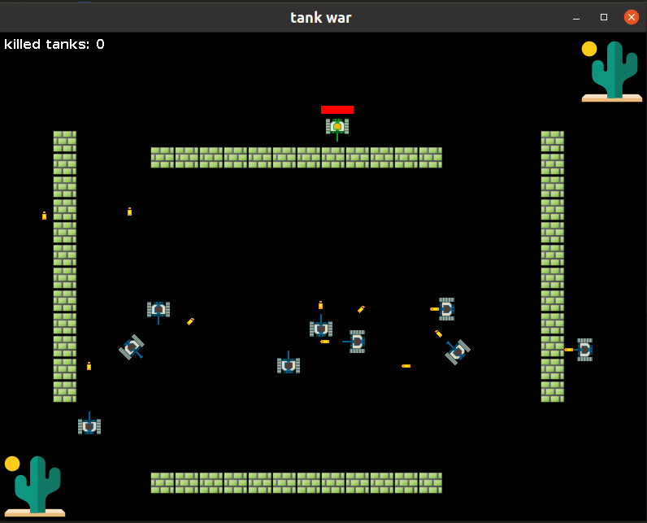

# Tank War

## Description
This is a project I used to learn java, and it was imatating an [udemy course](https://www.udemy.com/course/java-tank-war). But I used different version and system compared to the course, which made the development more difficult.

## Problems

1. [JavaFX crashes in loop on Ubuntu](https://stackoverflow.com/questions/66843349/javafx-media-crash-in-loop-with-because-of-error-gstreamer-pipeline-state-change) (**unsolved**)
   
2. [JavaFX can't play mp3 on Ubuntu](https://stackoverflow.com/questions/66939226/javafx-cant-play-mp3-file-with-mediaexception-on-ubuntu-20) (**solved**)

3. JavaFX can't be used crossed systems, e.g. I can't compress my tankwar package on Ubuntu to windows package, which makes the final step(learn how to make installer package pointless)(**solved**)

